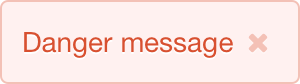
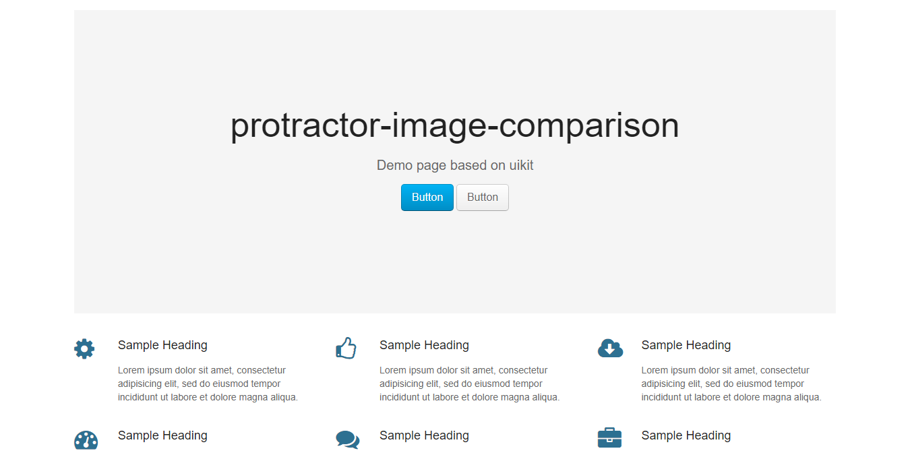
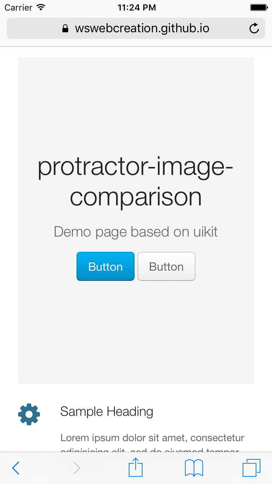
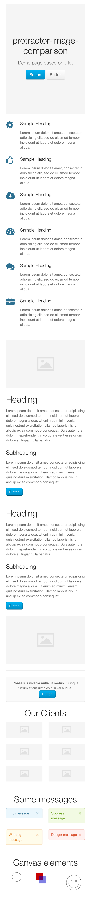
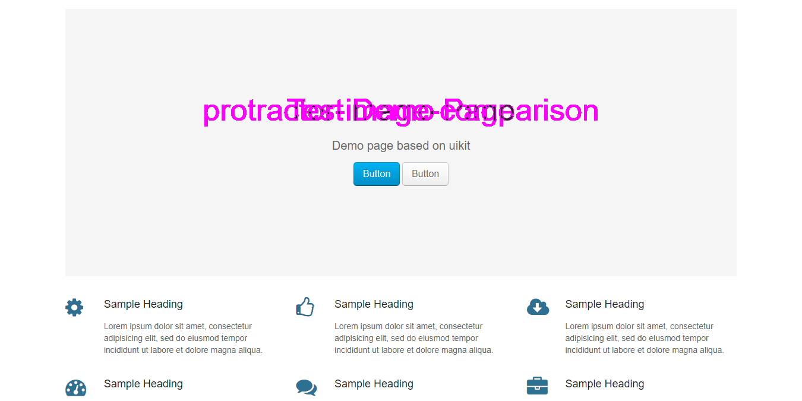
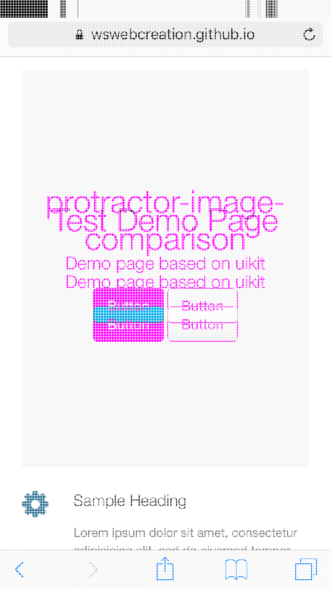
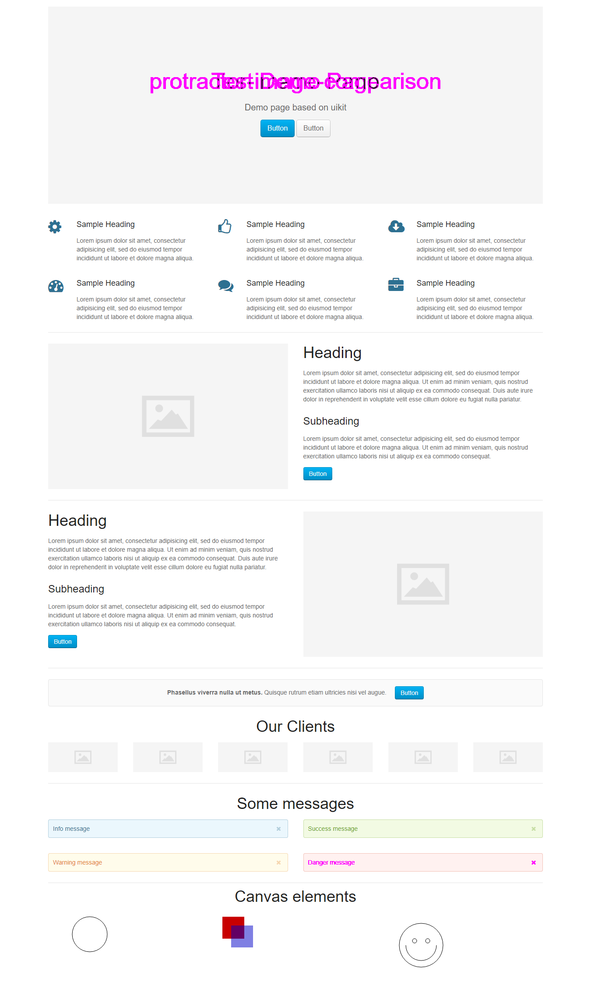
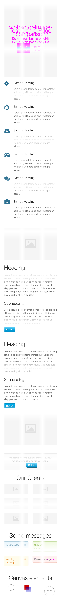

# Save output
## saveElement
### Desktop

### Mobile

## saveScreen
### Desktop

### Mobile

## saveFullPageScreens
### Desktop

### Mobile

# Check output on failure
## checkElement
### Desktop

### Mobile

## checkScreen
### Desktop

### Mobile

## checkFullPageScreens
### Desktop

### Mobile

